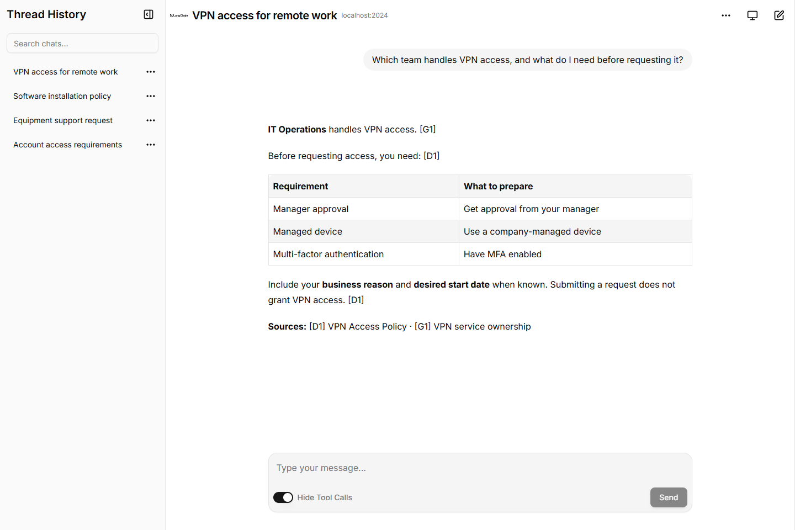
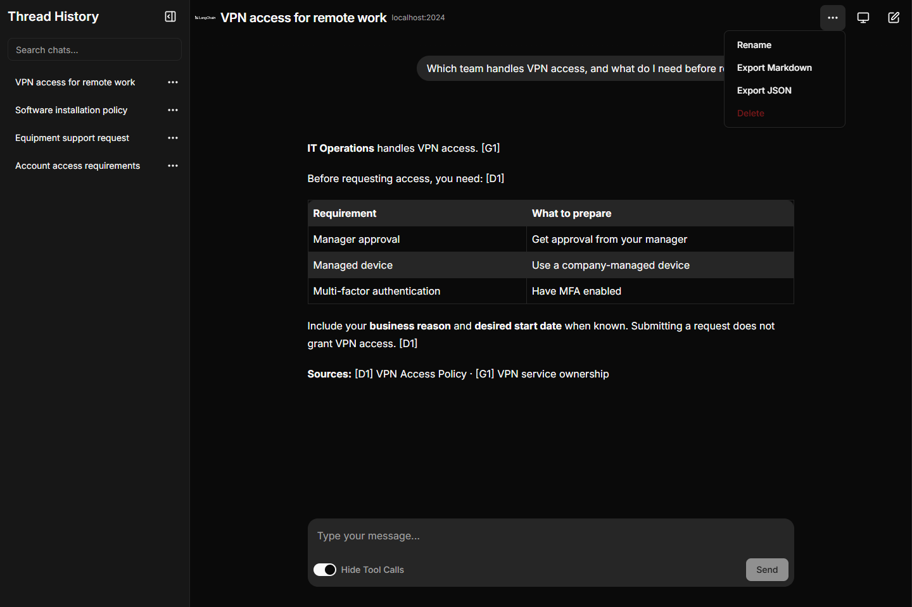
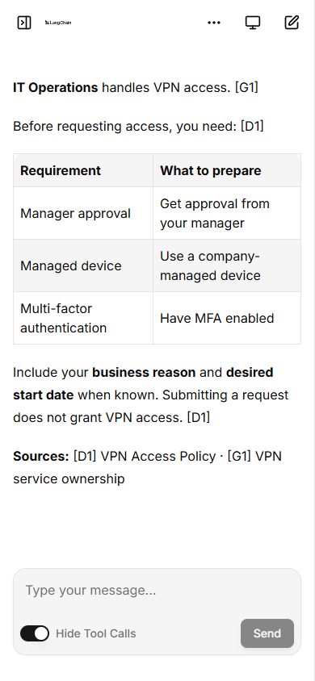
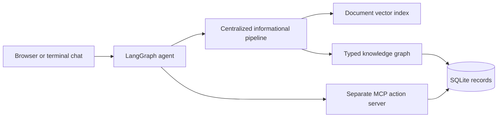

<div align="center">

# Multi-source internal assistant

**Ask about policies. Find the right team. Create and manage service requests.**

A LangGraph assistant combining document retrieval, a knowledge graph, and MCP actions,
with browser and terminal chat.

[Quick start](#quick-start) · [App preview](#app-preview) · [Architecture](docs/architecture.md) · [Demo guide](docs/demo.md)

</div>

<picture>
  <source media="(prefers-color-scheme: dark)" srcset="docs/images/desktop-dark.png">
  <source media="(prefers-color-scheme: light)" srcset="docs/images/desktop-light.png">
  
</picture>

*The actual browser UI, captured with fixed synthetic demo responses. The preview follows your light or dark appearance.*

## App preview

<table>
  <tr>
    <th>Dark mode and chat controls</th>
    <th>Mobile chat</th>
  </tr>
  <tr>
    <td valign="top"><a href="docs/images/chat-actions.png"></a></td>
    <td valign="top"><a href="docs/images/mobile.png"></a></td>
  </tr>
  <tr>
    <td>Search your history, rename chats, and export conversations.</td>
    <td>The same conversation on a smaller screen.</td>
  </tr>
</table>

Screenshots use the real UI with deterministic fixtures based on the synthetic
VPN policy and service ownership data; they are illustrative, not live model evaluation
results. [Recreate the captures](docs/images/README.md).

## What you can do

| Feature | Behavior |
| --- | --- |
| **Grounded answers** | Combine document passages and explicit graph relationships, with source citations. |
| **Service-request actions** | Create requests, update status, and assign teams through a separate MCP server. |
| **Visible tool activity** | Inspect retrieval and action calls, or hide them for a cleaner conversation. |
| **Conversation management** | Paginated history, title/message search, rename, Markdown/JSON export, and permanent deletion. |
| **Appearance** | Persistent Light, Dark, or System settings on desktop and mobile. |
| **Execution safeguards** | Server-owned history, same-thread concurrency rejection, and safeguards against replaying uncertain actions. |
| **Container setup** | One image for the backend and UI, automatic seeding/indexing, and persistent volumes. |

Deleting a conversation preserves service-request records and the independent
execution ledger. Additional chat providers and browser model selection remain
planned; chat and embeddings currently use Google.

## How it works



The model selects tools autonomously. Informational questions enter the centralized
retrieval pipeline; service-request mutations execute through MCP tools. Both chat
interfaces share orchestration and prompts. See [architecture](docs/architecture.md)
and [data/action contracts](docs/contracts.md) for details.

## Quick start

Use Docker Desktop with Linux containers. From the repository root, copy the
example environment for a fresh checkout:

```powershell
Copy-Item .env.example .env
```

Set `GOOGLE_API_KEY` in `.env` using your key from
[Google AI Studio](https://aistudio.google.com/apikey), then start the prebuilt image:

```powershell
$env:CHATBOT_IMAGE = "ghcr.io/luca-palminteri/multi-source-chatbot:latest"
docker compose up -d --pull always --no-build
```

| Service | Address |
| --- | --- |
| Browser chat | <http://localhost:3000> |
| Backend health | <http://localhost:20240/ok> |

Startup seeds the database and builds or reuses the document index. Initial
indexing calls the embedding provider; existing records are preserved, and named
volumes retain data and history across container replacement.

```powershell
docker compose logs -f chatbot
docker compose down  # stop while retaining data
```

Published tags support Linux amd64 and arm64. For registry access, pinned tags,
local builds, custom ports, and reset instructions, see [Docker setup](docs/docker.md).
This packages a local demo server without authentication; see the documented
[browser execution and history limits](docs/web-chat.md#execution-and-history-limits).

Want to run the services directly? Follow [browser setup](docs/web-chat.md).

## Terminal setup

The terminal application supports Python 3.10+; the browser server requires
Python 3.12+. The commands below use standard Windows Python 3.12.

```powershell
python -m pip install uv==0.12.23
uv sync --locked --extra runtime --python 3.12
Copy-Item .env.example .env  # only for a fresh checkout
```

Configure `GOOGLE_API_KEY` in `.env`, then seed, ingest, and start chat:

```powershell
.venv\Scripts\python -m assistant.cli seed
.venv\Scripts\python -m assistant.cli ingest
uv run --locked --extra runtime python -m assistant.cli chat
```

Chat launches its MCP server automatically. Use `/new` for a fresh conversation
and `/exit` to quit. Run from the project root, or pass `--root <project-directory>`
before a CLI subcommand. The installed `assistant` command exposes the same commands.

If an existing `.venv` uses MSYS Python, set
`$env:UV_PROJECT_ENVIRONMENT = ".venv-win"` before syncing and use `.venv-win`
in executable paths. MSYS executable paths use `.venv\bin\python.exe`.
Seeding and graph retrieval do not require credentials; ingestion, document
search, and chat do. Rerun ingestion after changing embedding providers or models.

<details>
<summary><strong>Explore retrieval from the CLI</strong></summary>

```powershell
.venv\Scripts\python -m assistant.cli graph emp-001 --step MEMBER_OF:out --step OWNS:out
.venv\Scripts\python -m assistant.cli graph svc-vpn --step OWNS:in
.venv\Scripts\python -m assistant.cli search "What does VPN access require?"
.venv\Scripts\python -m assistant.cli ask "Which team handles VPN access, and what does the access policy require?" --trace
```

See [terminal chat](docs/chat.md) for the complete startup sequence.

</details>

## Verification

Validate the synthetic dataset without credentials or dependencies (Python 3.10+):

```powershell
python scripts/validate_demo.py
```

After installing the runtime dependencies:

```powershell
uv run --locked --extra runtime python -m unittest discover -s tests -v
uv run --locked --extra runtime python scripts/check_mcp.py
```

CI runs Python checks on Linux (3.10/3.12) and Windows (3.12). Separate Linux and
Windows web jobs test the execution boundary and chat lifecycle, run disposable
Agent Server checks, and build the pinned UI. After these pass, the container job
builds both Linux architectures and publishes to GHCR from the default branch
and `v*` version tags.

Live Gemini evaluation is an explicit local command:

```powershell
uv run --locked --extra runtime python scripts/evaluate_demo.py
```

It makes real model/retrieval calls and isolated MCP writes using disposable demo
state; it does not reset your chat database. Reports default to
`runtime/evaluation.json`; use `--output` to preserve earlier reports. The prior
locked-run evidence is in `runtime/evaluation-locked-final.json` when available
in your local workspace. See [verification and demo instructions](docs/demo.md)
for evidence, expected behavior, and limits.

`uv.lock` pins dependencies across supported Python/platform combinations. To
refresh them deliberately, run `uv lock --upgrade`, sync, and rerun checks.

## Documentation and roadmap

| Guide | Covers |
| --- | --- |
| [Architecture](docs/architecture.md) | Scope, components, and design decisions |
| [Contracts](docs/contracts.md) | Data relationships and action behavior |
| [Example requests](docs/examples.md) | Informational, action, and mixed requests |
| [Retrieval](docs/retrieval.md) | Index setup, graph traversal, and validation |
| [Informational pipeline](docs/information.md) | Grounded synthesis and tool contract |
| [MCP actions](docs/actions.md) | Server startup, retry behavior, and smoke checks |
| [Agent orchestration](docs/agent.md) | Tool discovery, invocation, and memory |
| [Terminal chat](docs/chat.md) | CLI setup and conversation controls |
| [Browser chat](docs/web-chat.md) | Windows setup, appearance, history, and safeguards |
| [Docker](docs/docker.md) | Local builds, GHCR images, and persistent state |
| [Demo and verification](docs/demo.md) | Presenter conversation, reset workflow, and evidence |

[Implementation plan](plans/README.md): steps **1-9 and 11** are implemented.
Step **10**, additional providers and browser model selection, remains planned.
