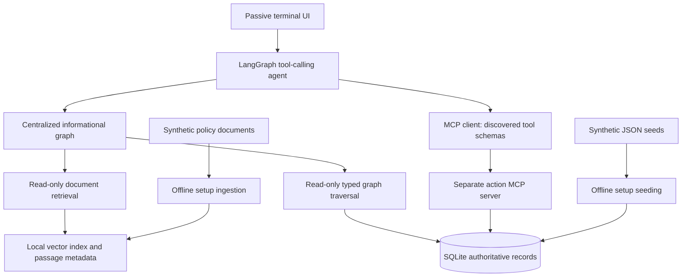

# Scope and architecture

The intended user is an employee at fictional Northstar Demo asking about
internal policies, service ownership, and their service requests. The assistant
can create service requests and change the status of their own requests. The
known session identity is Alex Rivera (`emp-001`), a member of Product Engineering.
This fixed identity is a demo convention, not production authentication.

Supported services: VPN access, software installation, equipment support, and
account access. Excluded actions: provisioning access, installing applications,
buying equipment, deleting records, and modifying policies or team membership.
Creating a request does not prove that policy prerequisites have been satisfied.

## Technology decisions

Use Python 3.10+, LangGraph for orchestration and the centralized informational
flow, and LangChain model/tool interfaces. Select Google Gemini
[Gemini 3.5 Flash-Lite](https://ai.google.dev/gemini-api/docs/models)
for tool calling and
[gemini-embedding-001](https://ai.google.dev/gemini-api/docs/embeddings)
for document embeddings. Both providers and model IDs are configurable through
`.env.example`; provider factories are implemented in step 2. Changing embedding
models requires rebuilding the index. No live access is assumed.

Use a persisted local NumPy embedding matrix with cosine similarity and JSON
passage metadata for this tiny corpus. SQLite is authoritative for entities,
relationships, and mutable request records. Derive a typed adjacency graph from
SQLite on each informational call and traverse it explicitly; do not maintain
a second persistent copy of request state. The terminal UI only forwards messages
and displays responses. MCP uses a separate process and stdio transport.

The agent receives one informational tool plus MCP tools discovered through
`list_tools`. Model-selected tool calls determine intent; there is no keyword
router. Every informational question enters the informational graph, which gathers
document and graph evidence and synthesizes a cited response. MCP actions never
execute inside that graph. Mixed requests can retrieve prerequisites and then
invoke an MCP tool, asking for missing details before mutation. Validation and
tool-name dispatch implement contracts, not intent selection.

The informational database connection is read-only. The MCP server is the only
runtime writer. After a committed action, a fresh graph read sees the new request
state; requests are never embedded into the document index. Seeding is an explicit
setup command, not an exposed agent tool.

## Application layout

| Path | Responsibility / implementation step |
| --- | --- |
| `data/seed.json`, `data/documents/` | Step 1 synthetic sources |
| `docs/` | Step 1 decisions and contracts |
| `scripts/validate_demo.py` | Step 1 source validation |
| `src/assistant/config.py`, `storage.py`, `contracts.py` | Step 2 configuration, SQLite, shared types |
| `src/assistant/retrieval/` | Step 2 ingestion, document search, typed graph traversal |
| `src/assistant/information.py` | Step 3 centralized evidence/synthesis graph |
| `src/assistant/actions/` | Step 4 independent MCP server and transactional actions |
| `src/assistant/agent.py` | Step 5 tool discovery and autonomous orchestration |
| `src/assistant/chat.py` | Step 6 passive terminal |
| `tests/` | Contract, retrieval, MCP, orchestration checks as implemented |
| `runtime/` | Ignored generated SQLite/vector artifacts |

VPN's owning team is present only in structured relationships; approval and MFA
requirements are in policy documents. Answering who handles VPN and what is
required therefore needs both sources. A multi-hop traversal from Alex to Product
Engineering to that team's owned software service demonstrates explicit graph use.
