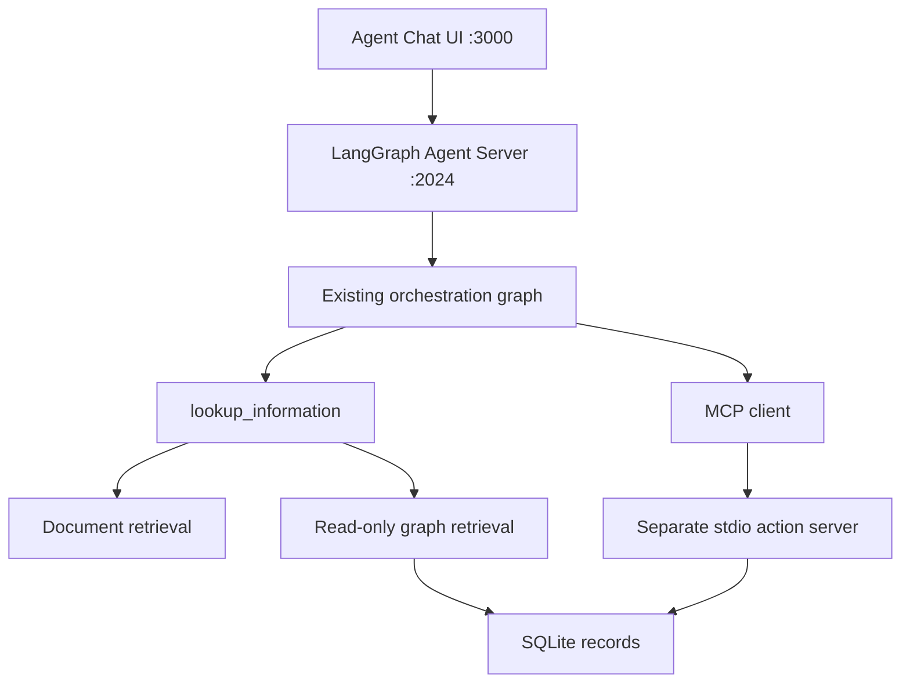

# Step 8: Connect LangChain Agent Chat UI

## Status and outcome

Implemented with the pinned upstream Agent Chat UI and LangGraph development
server. The terminal interface remains available; both interfaces use the same
model-selected tools, prompts, and MCP discovery configuration.

Windows verification: locked Python 3.12.15 web runtime, upstream UI production
build, dataset validation, MCP smoke check, unit/lifecycle tests, deterministic
Agent Server checks, and the real-model browser policy/create/read/update/read/
assignment sequence plus missing-details and invalid-ID cases. Refresh/history,
new-thread isolation, native tool IDs, replay rejection, concurrency, cancellation,
reconnect, uncertain actions and process cleanup are covered. MCP results match
disposable SQLite state. Evidence lives in ignored `runtime/web-smoke/` and
`runtime/web-verification/`; startup instructions are in [web-chat.md](../../docs/web-chat.md).

Compatibility findings: CLI 0.4.33 / API 0.15.3 supports context-managed factories,
requires the Windows console dependency and the MCP stdio `--allow-blocking`
override, and serves local runs without a LangSmith key when tracing is disabled.
The CLI loads its configured `.env` over shell variables, so demo paths must be
set there or in an explicit config env mapping. New UI turns explicitly clear
the SDK's implicit checkpoint and disable request retries. MCP text blocks are
normalized at the server boundary for upstream's built-in JSON renderer.
Failed-thread and submission state is stored in a separate durable safety ledger
keyed by server thread/run IDs, rather than relying on checkpoints that may fail
to commit during the same uncertain execution.

Scope: a reproducible local demo using Python 3.12, a LangGraph development server,
and the upstream Next.js UI. Public hosting and production authentication are
separate work. The interface remains passive, as required by
[INSTRUCTIONS.md](../../INSTRUCTIONS.md).

## Architecture



Expose the orchestration graph with a standard `messages` state. Preserve native
AI tool calls and ToolMessages so the upstream UI can display actual tool activity.
Wrapping `AgentSession.ask` in a single HTTP endpoint would hide those events and
does not supply the threads/runs API expected by this UI.

## 1. Verify and lock server compatibility

- Add an optional `web` dependency extra for the LangGraph CLI development server
  and required SDK/API dependencies; include the existing runtime adapter.
- Resolve this extra against `uv.lock` using standard Windows Python 3.12. Apply
  Python version markers where server dependencies require newer Python than the
  core application's Python 3.10 baseline. Keep existing CI installations valid.
- Verify the pinned server supports an async context-managed graph factory with
  resources held until a run finishes. Use that lifecycle for MCP; if unavailable,
  verify the documented server lifespan mechanism before implementing an alternative.
- Check the pinned CLI's LangSmith key requirement. Current server documentation
  lists a key as a prerequisite, although the local UI connection needs no key.
  Document the actual tested requirement and tracing settings separately.
- Pin the upstream UI revision and package-manager version; retain its lockfile
  and MIT license. Record the revision for reproducible setup.

Acceptance: a minimal graph starts through `langgraph dev`, is discoverable via
the API, and can complete a streamed run using the chosen dependency versions.

## 2. Share graph construction and MCP configuration

- Extract graph construction from `build_agent` in `src/assistant/agent.py` into
  a function returning the compiled orchestration graph. Continue wrapping that
  graph in `AgentSession` for the CLI.
- Accept an explicit checkpointer: the CLI retains its MemorySaver; the server
  supplies thread persistence. Do not create a separate MemorySaver or random
  thread ID inside the served graph.
- Extract the existing MCP connection/discovery context so both entrypoints reuse
  the same subprocess configuration, schema discovery, and initialization limits.
- Add `src/assistant/web.py` exporting the server graph factory. During each run,
  open the stdio MCP client, discover tools, construct the graph, yield it, and
  close resources after completion, errors, or cancellation. Schema inspection
  must work without leaking a child process or making paid model calls.
- Preserve explicit database, identity, root, and interpreter propagation. Keep
  the informational pipeline free of MCP clients and action storage imports.

Acceptance: server calls use real dynamically discovered MCP tools, and subprocess
cleanup succeeds after normal completion, cancellation, and initialization failure.

## 3. Preserve execution behavior at the server boundary

The served graph bypasses `AgentSession.ask`, which currently provides validation,
serialization, timeout handling, tracing, and a stopped-session flag. Port the
necessary behavior deliberately rather than silently losing it.

- Validate user messages against the existing nonblank/4000-character contract.
  Validate executable message input so callers cannot inject authoritative system
  messages or fabricated tool results. Keep demo identity server-configured.
- Use server thread IDs and checkpoint history; submit only new messages each turn.
  Serialize or reject concurrent runs on one thread. Separate threads must not
  share conversation state.
- Preserve the recursion limit and bounded execution. Surface sanitized provider
  and tool failures in the standard server error stream.
- Persist failed/uncertain execution state in thread state or metadata. Block
  ordinary continuation after an uncertain action until the user starts a new
  thread and retrieves current records, matching existing CLI behavior.
- Verify how the pinned server retries failed runs/nodes. Disable automatic
  mutation retries. Disconnect/reconnect must not resubmit an action; cancellation
  must not imply an already committed action was rolled back.
- Check upstream edit/resubmit and branch controls with action turns. If they can
  replay mutations, disable those controls with a small documented upstream patch
  and enforce the policy on the backend. Never treat checkpoint replay as undo.
- Keep current-turn version retrieval, model-selected routing, and faithful action
  result reporting. Validation branches are independent of intent selection.

Acceptance: failure, concurrency, reconnect, and replay checks cause no duplicate
mutation or false success report.

## 4. Configure the upstream browser interface

- Add `langgraph.json` mapping graph ID `assistant` to the verified graph factory,
  loading backend configuration from the existing `.env`.
- Place the pinned upstream application under `ui/agent-chat-ui/` without nested
  Git metadata. Limit UI edits to required configuration and verified action replay
  controls; use built-in conversation and tool rendering.
- Provide an example UI environment file with:

  ```dotenv
  NEXT_PUBLIC_API_URL=http://localhost:2024
  NEXT_PUBLIC_ASSISTANT_ID=assistant
  ```

- Keep Google and any LangSmith credentials in the backend environment. Ignore UI
  local env files, dependencies, build artifacts, and LangGraph local state.
- Bind the demo services locally and verify browser-origin access. Configure CORS
  only if needed by the pinned server.
- Show final answers and citations, lookup tool evidence, and MCP results using
  upstream components. Verify internal planning/synthesis model calls do not appear
  as extra assistant replies. Apply documented stream-hiding tags if necessary.

Acceptance: the browser connects, displays an answer and actual tool calls/results,
and starts independent conversations without custom routing or frontend development.

## 5. Verify and document the complete demo

- Run the existing unit suite, dataset validation, and MCP subprocess smoke check.
- Add focused integration checks for server discovery, streamed messages/tool IDs,
  thread continuity/isolation, lifecycle cleanup, concurrent runs, and uncertain
  execution. Use deterministic models and disposable databases for automated tests.
- Verify the pinned upstream UI builds. Run the browser demo against disposable
  seeded/indexed state with the configured real model.
- Repeat the existing policy, combined RAG/KG, create/read/update/read/assignment,
  missing-details, and invalid-ID examples. Compare tool results and database state.
- Refresh the page and verify history/follow-ups. Start a new thread and verify
  context isolation. Observe cancellation/reconnect behavior without retrying writes.
- Save browser/API verification evidence under ignored `runtime/` and extend the
  requirement-to-evidence map in `docs/demo.md`.
- Add `docs/web-chat.md` with tested Windows setup and two-terminal startup commands,
  configuration, shutdown, limits, and troubleshooting. Update README, architecture,
  and CI with relevant checks. Document the dev server's actual history persistence;
  do not promise production durability.

## Planned files

| File | Purpose |
| --- | --- |
| `src/assistant/agent.py` | Shared graph construction and MCP connection context |
| `src/assistant/web.py` | Server graph factory and execution safeguards |
| `langgraph.json` | Agent Server graph registration |
| `pyproject.toml`, `uv.lock` | Optional locked web runtime |
| `ui/agent-chat-ui/` | Pinned upstream interface and configuration example |
| `tests/test_web.py` | Server integration and lifecycle regressions |
| `scripts/check_web.py` | Reproducible API smoke check using isolated state |
| `docs/web-chat.md` | Setup, browser demo, and troubleshooting |
| README, architecture/demo docs, CI, `.gitignore` | Integration documentation and verification |

## Completion criteria

The documented fresh-checkout workflow launches the browser UI and server. Answers
retain citations; tool activity is visible; multi-turn actions execute through the
separate MCP server and become visible to later retrieval. New threads are isolated,
failure/reconnect paths do not repeat writes, and the CLI checks continue to pass.

## References

Official documentation checked on 2026-10-08. Recheck APIs against pinned versions
during the compatibility step.

- [Agent Chat UI repository and configuration](https://github.com/langchain-ai/agent-chat-ui)
- [Agent Chat UI connection and tool rendering](https://docs.langchain.com/oss/python/langgraph/ui)
- [Local Agent Server development and graph registration](https://docs.langchain.com/langsmith/local-dev-testing)
- [Server runtime and context-managed graph factories](https://reference.langchain.com/python/langgraph-sdk/runtime)
